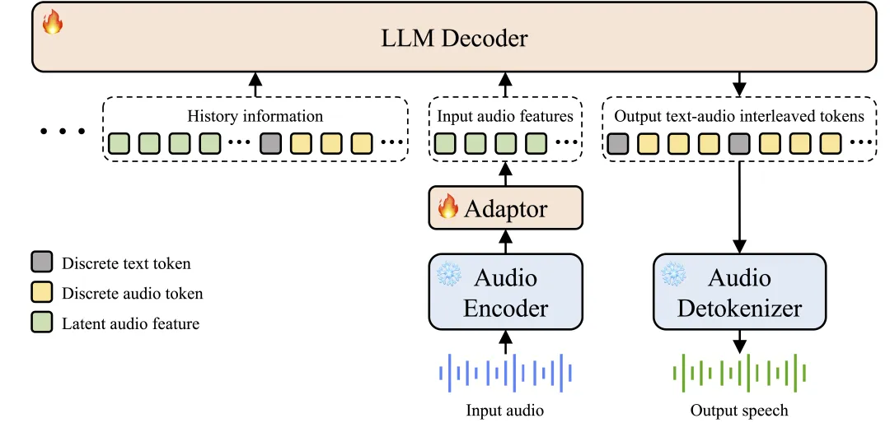
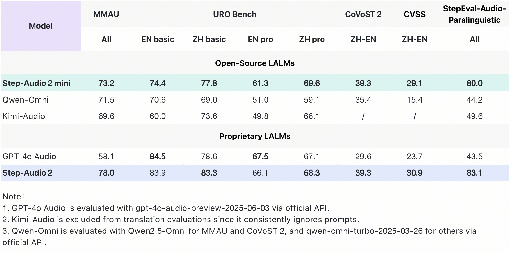
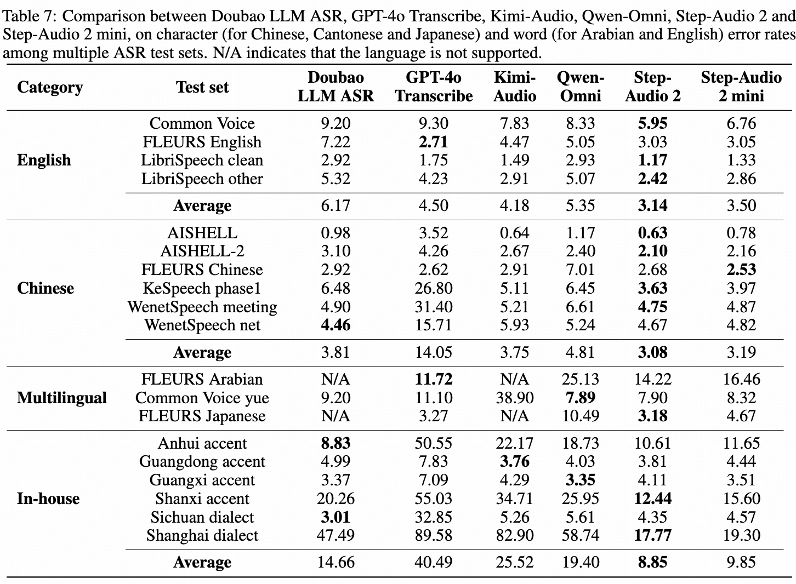

## Project Resources

- 📄 **Paper**: [arXiv:2507.16632](https://arxiv.org/abs/2507.16632)
- 💻 **GitHub**: [stepfun-ai/Step-Audio2](https://github.com/stepfun-ai/Step-Audio2)
- 🌐 **Tech Blog**: [中文](https://www.stepfun.com/research/zh/step-audio2) | [English](https://www.stepfun.com/research/en/step-audio2)

---

## Overview

Step-Audio 2 is **the world's first end-to-end audio large language model with deep thinking capabilities designed for industrial applications**. This model innovatively combines a latent space audio encoder with audio reinforcement learning technology. It effectively captures paralinguistic information and speaking style features, and adopts a Chain-of-Thought (CoT) reasoning strategy combined with reinforcement learning optimization. Step-Audio 2 achieves high-performance speech dialogue capabilities across various scenarios. Experimental results demonstrate that the model achieves state-of-the-art (SOTA) performance on multiple understanding and dialogue tasks.

## Architecture

Traditional AI voice systems have been criticized for lacking both intelligence and emotional understanding. First, they lack the knowledge base and reasoning capabilities comparable to text-based large models. Second, they sound "robotic" and fail to comprehend subtext, tone, emotions, and laughter—the "unspoken meanings." Step-Audio 2 solves these problems through innovative architectural design, achieving both cognitive and emotional intelligence.

## Core Features

- **Genuine End-to-End Multimodal Architecture**: Step-Audio 2 breaks through the traditional ASR+LLM+TTS three-stage structure, achieving direct conversion from raw audio input to speech response output. The architecture is more concise with lower latency, and can effectively understand paralinguistic information and non-vocal signals.

- **CoT Reasoning Combined with Reinforcement Learning**: Step-Audio 2 is the first to introduce Chain-of-Thought (CoT) reasoning combined with reinforcement learning optimization in end-to-end speech models. It can perform fine-grained understanding, reasoning, and natural response to paralinguistic and non-speech signals such as emotions, intonation, and music.

- **Audio Knowledge Enhancement**: The model supports external tools including web search, helping to solve hallucination problems and enabling multi-scenario expansion capabilities.

## SOTA Performance

Step-Audio 2 achieves **SOTA results** across multiple key benchmarks, demonstrating outstanding performance in audio understanding, speech recognition, translation, and dialogue scenarios. The overall performance surpasses all open-source end-to-end speech models including Qwen-Omni and Kimi-Audio, and exceeds GPT-4o Audio in most tasks.

**Key Performance Metrics**

- **MMAU (General Multimodal Audio Understanding)**: Ranks **#1** with a score of **78**

- **URO Bench (Spoken Dialogue Capability)**: **#1 in Chinese, #2 in English**, demonstrating excellent dialogue understanding and expression abilities

- **Machine Translation Tasks**:
  - CoVoST 2 benchmark: **39.3**
  - CVSS benchmark: **30.9**
  - Significantly outperforms GPT-4o Audio and other open-source speech models

- **Speech Recognition Tasks**: Achieves first place in multiple languages and dialects
  - Average CER (Character Error Rate) on open-source Chinese test sets: **3.08**
  - Average WER (Word Error Rate) on open-source English test sets: **3.14**
  - Far ahead of other models

- **Paralinguistic Understanding Tasks**: Ranks **#1** with a score of **83.1**

